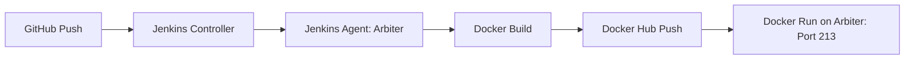

# DevOps Excellence Portfolio - LAMBARAA Abdellah

## 🏗️ CI/CD Architecture

This project uses a distributed Jenkins architecture:
- **VM Jenkins (192.168.12.201)**: Orchestrates the pipeline.
- **VM Arbiter (192.168.12.203)**: Acts as a Jenkins SSH Agent where Docker builds and deployments occur.

## 🚀 Key Features

- **Premium Design System**: Modern dark theme with glassmorphism and smooth animations.
- **Advanced CI/CD Patterns**: Documentation of industrial-grade pipelines using Jenkins and GitHub Actions.
- **Cloud Native Focus**: Demonstrations of Kubernetes orchestration and Docker optimization.
- **Responsive Architecture**: Fully responsive design with an integrated mobile navigation system.

## 🛠️ Tech Stack

- **Frontend**: HTML5, Vanilla CSS3 (Custom Design System), JavaScript (ES6+).
- **Automation**: Jenkins, GitHub Actions.
- **Orchestration**: Docker, Kubernetes.
- **Infrastructure**: Terraform, Ansible.

## 📈 Engineering Philosophy

"Automation First" – Bridging the gap between software development and IT operations through radical automation, continuous monitoring, and version-controlled infrastructure.

## 👨‍💻 Author

**LAMBARAA Abdellah**
- Master BDCC Student - 2026
- DevOps & Big Data Enthusiast

---
*Built with precision, engineered for scale.*
