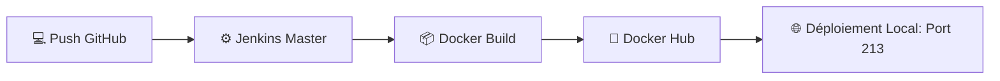
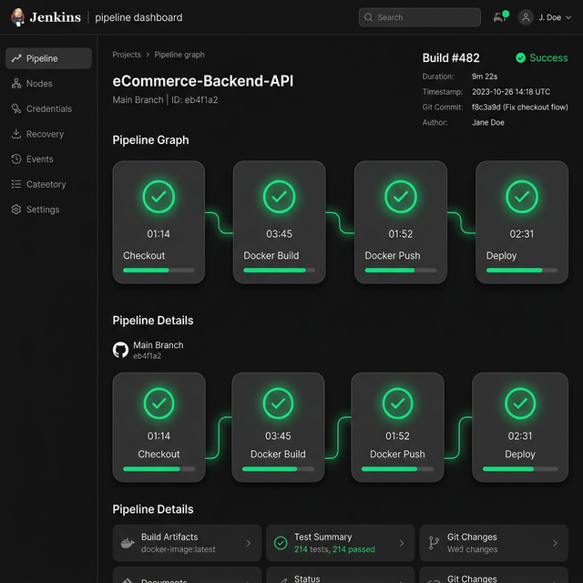

# 🚀 DevOps Excellence Portfolio - LAMBARAA Abdellah

Ce projet est une démonstration complète d'une chaîne **CI/CD (Intégration et Déploiement Continus)** automatisée, allant du développement frontend jusqu'au déploiement containerisé.

## 🏗️ Architecture du Pipeline

Le pipeline est orchestré par **Jenkins** fonctionnant dans un conteneur Docker. Il automatise chaque étape du cycle de vie de l'application.



## 📸 Aperçu du Pipeline

*Visualisation du succès de l'automatisation dans Jenkins.*

## 🚀 Fonctionnalités Clés

- **Design Premium** : Interface moderne avec effet de verre (glassmorphism) et responsive design.
- **Automatisation Totale** : Pipeline Jenkins intelligent qui gère le build et le push Docker.
- **Sécurité** : Gestion des secrets (Docker Hub Token) via Jenkins Credentials.
- **Optimisation** : Utilisation d'images Docker légères (`nginx:stable-alpine`).

## 🛠️ Installation & Configuration

### 1. Prérequis
- Docker Desktop installé et fonctionnel.
- Un compte Docker Hub.

### 2. Lancer Jenkins (Local)
Utilisez la commande suivante pour démarrer Jenkins avec accès au moteur Docker de votre machine :
```powershell
docker run -d -p 8080:8080 -p 50000:50000 -v jenkins_home:/var/jenkins_home -v //var/run/docker.sock:/var/run/docker.sock --name jenkins-master jenkins/jenkins:lts
```

### 3. Configurer l'Agent Docker
À l'intérieur de Jenkins, pour permettre la construction d'images :
```powershell
docker exec -u 0 jenkins-master apt-get update
docker exec -u 0 jenkins-master apt-get install -y docker.io
docker exec -u 0 jenkins-master chmod 666 /var/run/docker.sock
```

## 🧰 Tech Stack

- **Frontend** : HTML5, CSS3 (Custom Design System), JS ES6+.
- **DevOps** : Jenkins, Docker, Git.
- **Registry** : Docker Hub.

## 👨‍💻 Auteur

**LAMBARAA Abdellah**
- Étudiant Master BDCC - 2026
- Passionné par le DevOps et le Cloud Native.

---
*Projet réalisé dans le cadre du module DevOps - Automatisation et Qualité Logicielle.*
