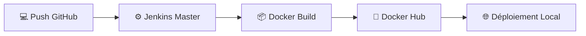
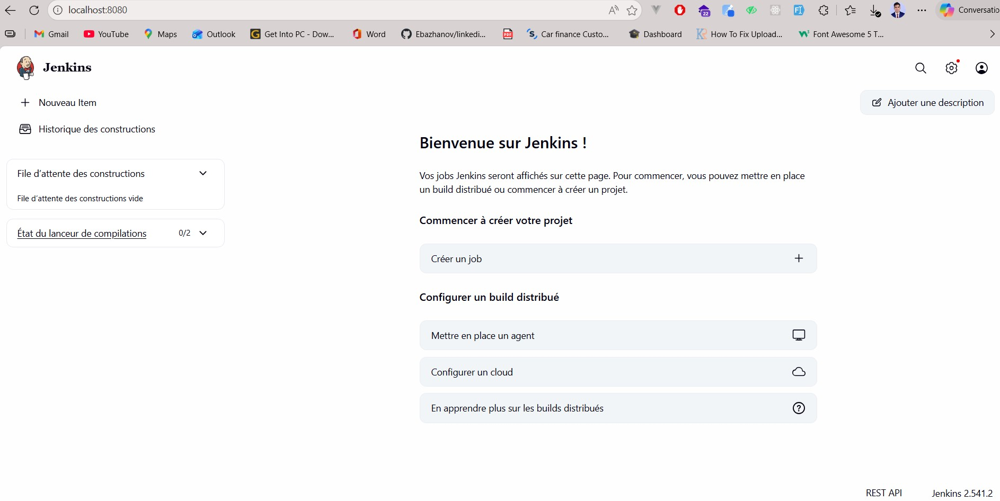
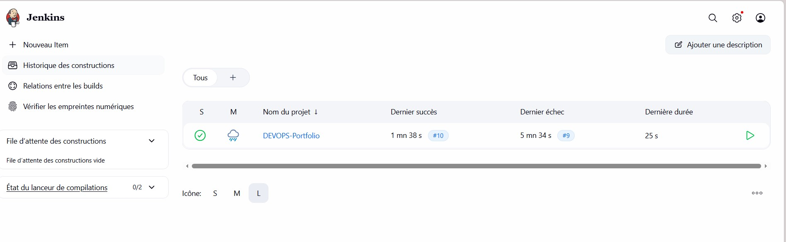
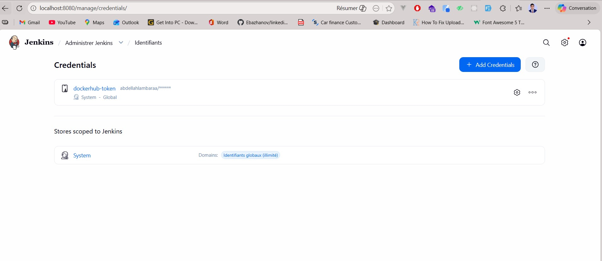
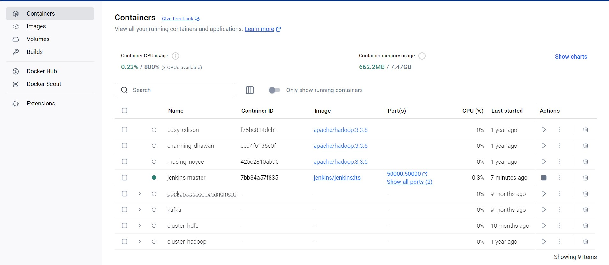
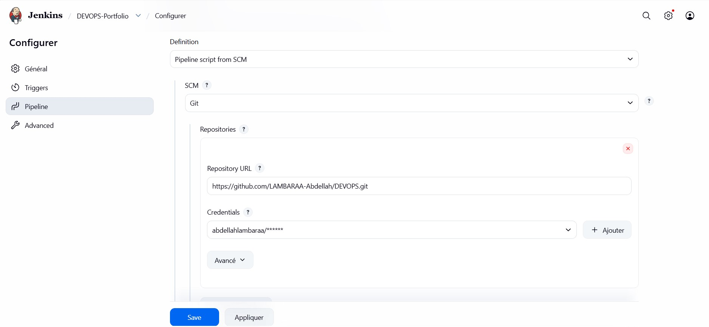

# 🚀 DevOps Excellence Portfolio - LAMBARAA Abdellah

Ce projet est une démonstration complète d'une chaîne **CI/CD (Intégration et Déploiement Continus)** automatisée.

## 🏗️ Architecture du Pipeline

Le pipeline est orchestré par **Jenkins** fonctionnant dans un conteneur Docker.



## 📸 Aperçus du Projet

### 🎨 Interface du Portfolio

*Design premium avec glassmorphisme et responsive design.*

### ⚙️ Automatisation Jenkins


*Pipeline fonctionnel et déploiement réussi.*

## 🛠️ Guide d'Installation Visuel

### 1. Configuration des Identifiants (Docker Hub)

*Génération du token de sécurité pour Jenkins.*

### 2. Lancement de Jenkins
```powershell
docker run -d -p 8080:8080 -p 50000:50000 -v jenkins_home:/var/jenkins_home -v //var/run/docker.sock:/var/run/docker.sock --name jenkins-master jenkins/jenkins:lts
```

### 3. Installation des outils Docker dans Jenkins

Exécutez :
```powershell
docker exec -u 0 jenkins-master apt-get update
docker exec -u 0 jenkins-master apt-get install -y docker.io
docker exec -u 0 jenkins-master chmod 666 /var/run/docker.sock
```

### 4. Configuration du Job (Scm & Branche)

*Lien entre GitHub et Jenkins.*

## 🌐 Accès Réseau

*Application accessible sur le réseau local.*

## 👨‍💻 Auteur

**LAMBARAA Abdellah**  
Étudiant Master BDCC - 2026

---
*Projet réalisé dans le cadre du module DevOps.*
